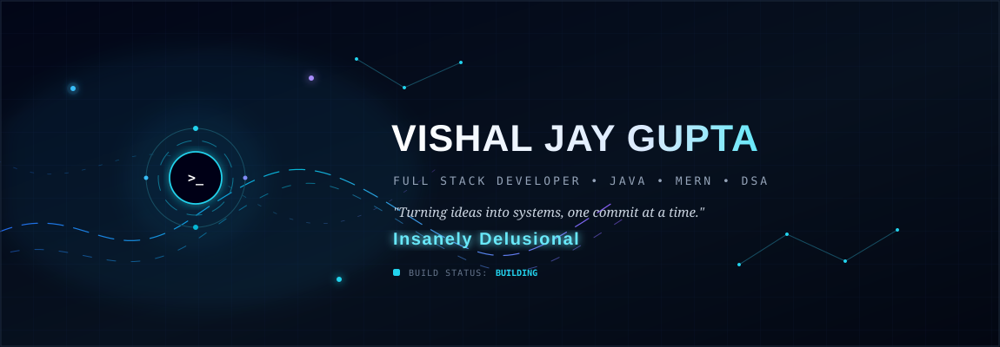

 

 

## Tech Stack

| **Sector**      | **Technologies**                                                 |
| --------------- | ---------------------------------------------------------------- |
| **Languages**   | Java · C · C++ · JavaScript                                      |
| **Frontend**    | HTML5 · CSS3 · JavaScript · React.js · Tailwind CSS · Bootstrap  |
| **Backend**     | Node.js · Express.js · REST APIs                                 |
| **Database**    | MongoDB · SQL                                                    |
| **Tools**       | Git · GitHub · VS Code · Vite · Postman                          |
| **Core CS**     | OOP · DBMS · Operating Systems · Data Structures & Algorithms    |
| **Development** | Responsive Web Design · Problem-Solving · Full-Stack Development |

 
 

  

    

  | 🧠 **DSA** | ☕ **Java** | ⚡ **MERN** | 🚀 **Building** |
  |:---:|:---:|:---:|:---:|
  | Problem Solving | Primary DSA Language | Full-Stack Development | Projects & Skills |

   

  

